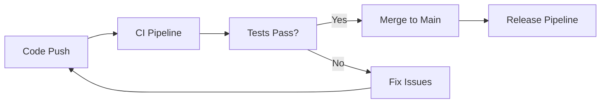
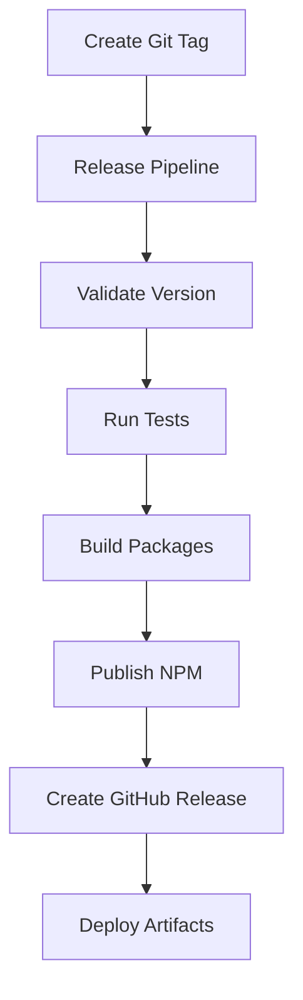

# CI/CD Pipeline Setup for CodeCrucible Synth

## Overview

This document describes the comprehensive CI/CD pipeline setup for CodeCrucible Synth, a TypeScript-based CLI and desktop application with multi-voice AI capabilities.

## 🚀 Pipeline Components

### 1. Main CI Pipeline (`.github/workflows/ci.yml`)

**Triggers:** Push/PR to main/develop branches

**Jobs:**
- **Lint and Type Check**: ESLint + TypeScript compilation
- **Test**: Jest unit tests with coverage
- **Build**: Full application build with artifacts
- **Security Audit**: npm audit + Snyk scanning
- **Dependency Review**: Automated dependency vulnerability checks

**Features:**
- Node.js 18+ support
- NPM caching for faster builds
- Codecov integration for test coverage
- Security scanning with configurable thresholds

### 2. Release Pipeline (`.github/workflows/release.yml`)

**Triggers:** 
- Git tags (`v*.*.*`)
- Manual workflow dispatch

**Jobs:**
- **Validate Release**: Version format validation
- **Test Before Release**: Full test suite execution
- **Build Packages**: Multi-platform builds (Windows, macOS, Linux)
- **Publish NPM**: Automated NPM package publishing
- **Create GitHub Release**: Release with changelog and assets
- **Notify**: Success/failure notifications

**Assets Generated:**
- Standalone binaries (Windows `.exe`, macOS, Linux)
- Desktop applications (NSIS, DMG, AppImage)
- NPM package publication
- GitHub release with comprehensive notes

### 3. Security Pipeline (`.github/workflows/security.yml`)

**Triggers:** 
- Push/PR to main/develop
- Weekly scheduled scans
- Manual dispatch

**Security Scans:**
- **Dependency Audit**: NPM audit with severity thresholds
- **Snyk Security**: Advanced vulnerability scanning
- **CodeQL Analysis**: GitHub's semantic code analysis
- **Semgrep**: Static analysis security testing
- **License Compliance**: Automated license checking
- **Secrets Detection**: TruffleHog secret scanning

**Reports:**
- Consolidated security summary
- PR comments with security status
- Artifact reports for audit trails

### 4. Desktop Build Pipeline (`.github/workflows/build-desktop.yml`)

**Triggers:** 
- Push/PR to main/develop
- Manual workflow dispatch

**Multi-Platform Builds:**

| Platform | Artifacts | Signing |
|----------|-----------|---------|
| Windows | `.exe` (NSIS installer) | Optional code signing |
| macOS | `.dmg` + notarization | Apple Developer ID |
| Linux | `.AppImage` | GPG signing |

**Features:**
- Matrix builds for parallel execution
- Electron Builder integration
- Asset verification and testing
- Cross-platform compatibility testing

### 5. Performance Monitoring (`.github/workflows/performance-monitor.yml`)

**Triggers:**
- Weekly scheduled runs
- PR performance impact analysis

**Metrics:**
- Build time tracking
- Bundle size analysis
- Dependency impact assessment
- Performance regression detection
- CI/CD pipeline optimization suggestions

### 6. Pipeline Testing (`.github/workflows/test-pipeline.yml`)

**Purpose:** End-to-end pipeline validation

**Test Scopes:**
- **Quick**: Basic functionality and compilation
- **Full**: Comprehensive application testing

## 🔧 Setup Instructions

### Prerequisites

1. **Repository Secrets** (Required for full functionality):
   ```
   NPM_TOKEN              # NPM publishing
   SNYK_TOKEN             # Security scanning
   CSC_LINK               # macOS code signing
   CSC_KEY_PASSWORD       # macOS signing password
   WIN_CSC_LINK           # Windows code signing
   WIN_CSC_KEY_PASSWORD   # Windows signing password
   APPLE_ID               # macOS notarization
   APPLE_APP_SPECIFIC_PASSWORD  # Apple credentials
   APPLE_TEAM_ID          # Apple Developer Team
   ```

2. **Branch Protection** (Recommended):
   - Require status checks: CI pipeline
   - Require up-to-date branches
   - Restrict pushes to main branch

### Configuration Files

1. **Package.json Scripts**:
   ```json
   {
     "scripts": {
       "build": "tsc && npm run copy-assets",
       "test": "jest",
       "lint": "eslint src/**/*.ts",
       "package:win": "pkg dist/index.js --targets node18-win-x64 --output build/codecrucible-win.exe",
       "package:mac": "pkg dist/index.js --targets node18-macos-x64 --output build/codecrucible-macos", 
       "package:linux": "pkg dist/index.js --targets node18-linux-x64 --output build/codecrucible-linux",
       "desktop:build": "electron-builder"
     }
   }
   ```

2. **TypeScript Configuration** (`tsconfig.json`):
   - ES2022 target for modern Node.js
   - ESNext modules with Node resolution
   - Strict type checking enabled
   - Source maps for debugging

3. **ESLint Configuration**:
   - TypeScript-specific rules
   - Consistent code style enforcement
   - Security-focused linting

## 📊 Pipeline Workflow

### Development Workflow



### Release Workflow



## 🔍 Monitoring and Debugging

### Build Logs
- All pipelines generate comprehensive logs
- Artifacts stored for 30 days
- Performance metrics tracked over time

### Error Handling
- Graceful fallbacks for optional features
- Detailed error reporting
- Automatic retry mechanisms where appropriate

### Security Monitoring
- Weekly automated security scans
- PR-based security impact analysis
- License compliance checking
- Secret detection and prevention

## 📈 Performance Optimization

### Caching Strategy
- NPM dependencies cached per lockfile hash
- Electron binaries cached per platform
- Build artifacts cached for reuse

### Parallel Execution
- Matrix builds for multi-platform support
- Concurrent job execution where possible
- Optimized dependency installation

### Resource Management
- Appropriate timeouts for all operations
- Resource limits to prevent runaway processes
- Efficient artifact storage and cleanup

## 🚀 Usage Examples

### Manual Release
```bash
# Create and push a new version tag
git tag v2.0.1
git push origin v2.0.1

# This triggers the release pipeline automatically
```

### Security Scan
```bash
# Trigger manual security scan
gh workflow run security.yml
```

### Desktop Build Test
```bash
# Test desktop builds for all platforms
gh workflow run build-desktop.yml --field build_type=development
```

### Pipeline Testing
```bash
# Test the entire pipeline
gh workflow run test-pipeline.yml --field test_scope=full
```

## 🎯 Success Metrics

### Quality Gates
- ✅ All tests pass (minimum 90% coverage)
- ✅ No high/critical security vulnerabilities
- ✅ TypeScript compilation without errors
- ✅ Linting passes with acceptable warnings
- ✅ All artifacts build successfully

### Performance Targets
- Build time < 5 minutes
- Test execution < 2 minutes  
- Package generation < 10 minutes per platform
- Total release pipeline < 30 minutes

### Security Standards
- Zero critical vulnerabilities
- Maximum 3 high-severity issues
- All dependencies use approved licenses
- No secrets in repository

## 📞 Support and Troubleshooting

### Common Issues

1. **Build Failures**: Check TypeScript errors and dependencies
2. **Test Failures**: Verify mock configurations and test data
3. **Security Scan Failures**: Review dependency versions and licenses
4. **Release Issues**: Validate version format and branch state

### Debugging Steps

1. Check workflow run logs in GitHub Actions
2. Review artifact contents for build issues
3. Validate environment variables and secrets
4. Test locally with same Node.js version

### Getting Help

- **CI/CD Issues**: Check GitHub Actions documentation
- **Build Problems**: Review TypeScript and packaging configs
- **Security Concerns**: Consult security scan reports
- **Performance Issues**: Check performance monitoring artifacts

---

## 🎉 Conclusion

This CI/CD pipeline provides comprehensive automation for:
- ✅ **Quality Assurance**: Automated testing and linting
- ✅ **Security**: Multi-layer security scanning and monitoring
- ✅ **Deployment**: Automated package building and publishing
- ✅ **Monitoring**: Performance tracking and optimization
- ✅ **Maintenance**: Dependency management and updates

The pipeline is designed to scale with the project and provides the foundation for reliable, secure, and efficient software delivery.