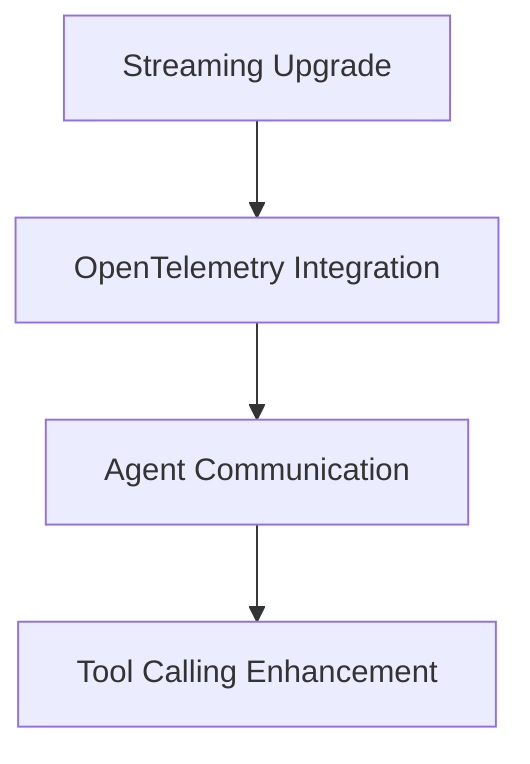

# CodeCrucible Synth - Gap Analysis and Recommendations  
## Feature Comparison with Industry Leaders

**Date:** August 23, 2025  
**Analysis Scope:** Feature parity with leading CLI AI agent platforms  
**Comparison Baseline:** Vercel AI SDK v5.0, LangChain Agents, Semantic Kernel, AutoGen

---

## Executive Summary

CodeCrucible Synth **leads in several innovative areas** (hybrid model architecture, Living Spiral methodology, MCP integration) while **lagging in modern streaming patterns and observability standards**. This document provides a detailed gap analysis and prioritized roadmap for achieving feature parity with 2025 industry leaders.

### Priority Assessment
- 🔴 **Critical Gaps:** Require immediate attention (1-2 weeks)
- 🟡 **Important Gaps:** Should be addressed soon (1-2 months)  
- 🟢 **Enhancement Opportunities:** Future improvements (3-6 months)

---

## Critical Gaps Analysis (🔴)

### 1. Modern Streaming Protocols

**Gap:** CodeCrucible lacks AI SDK v5.0 streaming lifecycle patterns  
**Impact:** Suboptimal real-time user experience, incompatibility with modern AI tools  
**Industry Standard:**

```typescript
// Industry Standard (AI SDK v5.0)
for await (const chunk of result.fullStream) {
  switch (chunk.type) {
    case 'text-start':
      console.log(`Starting text block: ${chunk.id}`);
      break;
    case 'text-delta':
      process.stdout.write(chunk.delta);
      break;
    case 'text-end':
      console.log(`Completed text block: ${chunk.id}`);
      break;
    case 'tool-call':
      handleToolCall(chunk.toolCallId, chunk.toolName, chunk.args);
      break;
    case 'tool-result':
      displayToolResult(chunk.toolCallId, chunk.result);
      break;
    case 'reasoning-start':
      showReasoningIndicator(chunk.id);
      break;
    case 'reasoning-delta':
      updateReasoning(chunk.id, chunk.delta);
      break;
    case 'stream-start':
      handleWarnings(chunk.warnings);
      break;
    case 'finish':
      showUsageStats(chunk.usage);
      break;
  }
}
```

**Current CodeCrucible Implementation:**
```typescript
// Current pattern (Limited)
for await (const chunk of result.textStream) {
  process.stdout.write(chunk);
}
```

**🎯 Recommendation:** Implement comprehensive streaming lifecycle in `StreamingManager`

### 2. OpenTelemetry Integration

**Gap:** No distributed tracing or modern observability  
**Impact:** Difficult debugging in production, poor monitoring capabilities  
**Industry Standard:**

```typescript
// Industry Standard (OpenTelemetry)
import { trace, metrics, logs } from '@opentelemetry/api';

export class TelemetryProvider {
  private tracer = trace.getTracer('codecrucible-synth');
  private meter = metrics.getMeter('codecrucible-synth');
  
  async traceModelRequest<T>(operation: string, fn: () => Promise<T>): Promise<T> {
    return await this.tracer.startActiveSpan(operation, async (span) => {
      try {
        span.setAttributes({
          'codecrucible.model': this.model,
          'codecrucible.provider': this.provider
        });
        return await fn();
      } catch (error) {
        span.recordException(error);
        throw error;
      } finally {
        span.end();
      }
    });
  }
}
```

**🎯 Recommendation:** Add OpenTelemetry to `PerformanceMonitor` and `UnifiedModelClient`

### 3. Agent-to-Agent Communication

**Gap:** Limited direct agent communication capabilities  
**Impact:** Cannot implement advanced multi-agent patterns from Semantic Kernel  
**Industry Standard:**

```typescript
// Industry Standard (Semantic Kernel style)
export interface Agent {
  id: string;
  name: string;
  invoke(messages: Message[]): Promise<AgentResponse>;
  subscribeToAgent(agentId: string): void;
  publishToAgent(agentId: string, message: Message): void;
}

export class AgentOrchestration<TInput, TOutput> {
  private agents: Agent[] = [];
  private strategy: OrchestrationStrategy;
  
  async execute(input: TInput): Promise<OrchestrationResult<TOutput>> {
    return await this.strategy.orchestrate(this.agents, input);
  }
}
```

**🎯 Recommendation:** Extend `VoiceArchetypeSystem` with agent communication protocols

---

## Important Gaps Analysis (🟡)

### 4. Tool Calling Modernization

**Gap:** Basic tool calling vs industry standard tool orchestration  
**Current Implementation:**
```typescript
// Current pattern
class AdvancedToolOrchestrator {
  async executeTools(tools: Tool[]): Promise<any[]> {}
}
```

**Industry Standard:**
```typescript
// Modern pattern with streaming tool calls
export interface ToolCall {
  id: string;
  name: string;
  arguments: unknown;
  status: 'pending' | 'running' | 'completed' | 'error';
}

export class ModernToolOrchestrator {
  async *executeToolStream(call: ToolCall): AsyncGenerator<ToolCallDelta> {
    yield { type: 'tool-call-start', id: call.id, name: call.name };
    
    for await (const delta of this.executeTool(call)) {
      yield { type: 'tool-call-delta', id: call.id, delta };
    }
    
    yield { type: 'tool-call-end', id: call.id, result };
  }
}
```

**🎯 Recommendation:** Modernize tool calling with streaming support and better error handling

### 5. Structured Output Support

**Gap:** Limited structured output capabilities  
**Industry Standard:**

```typescript
// Modern structured outputs
export interface StructuredResponse<T> {
  schema: JsonSchema;
  data: T;
  confidence: number;
  reasoning?: string;
}

export class StructuredOutputClient {
  async generateStructured<T>(
    prompt: string, 
    schema: JsonSchema,
    options?: GenerationOptions
  ): Promise<StructuredResponse<T>> {
    // Implementation with schema validation
  }
}
```

**🎯 Recommendation:** Add structured output support to `UnifiedModelClient`

### 6. Caching Strategy Enhancement

**Gap:** Basic caching vs distributed intelligent caching  
**Current:** Simple in-memory caching  
**Industry Standard:**

```typescript
// Modern distributed caching
export class IntelligentCache {
  constructor(
    private redis: RedisClient,
    private semantic: SemanticSimilarity
  ) {}
  
  async getSemanticallySimilar(query: string, threshold = 0.85): Promise<CacheEntry[]> {
    const queryEmbedding = await this.embed(query);
    return await this.redis.vectorSearch('cache_embeddings', queryEmbedding, threshold);
  }
  
  async store(key: string, value: any, semanticContext?: string): Promise<void> {
    if (semanticContext) {
      const embedding = await this.embed(semanticContext);
      await this.redis.setWithVector(key, value, embedding);
    }
  }
}
```

**🎯 Recommendation:** Implement semantic caching with Redis + vector search

---

## Enhancement Opportunities Analysis (🟢)

### 7. Multi-Modal Capabilities

**Gap:** Text-only processing vs multi-modal AI  
**Industry Trend:** Vision, audio, and document processing integration  
**Future Implementation:**

```typescript
export interface MultiModalInput {
  text?: string;
  images?: ImageData[];
  audio?: AudioData[];
  documents?: DocumentData[];
}

export class MultiModalProcessor {
  async process(input: MultiModalInput): Promise<ProcessingResult> {
    const results = await Promise.all([
      input.text && this.processText(input.text),
      input.images && this.processImages(input.images),
      input.audio && this.processAudio(input.audio),
      input.documents && this.processDocuments(input.documents)
    ]);
    
    return this.synthesizeResults(results);
  }
}
```

### 8. Cloud-Native Patterns

**Gap:** Limited cloud-native deployment patterns  
**Enhancement:** Kubernetes operators, service mesh integration  
**Future Implementation:**

```yaml
# Kubernetes Operator pattern
apiVersion: codecrucible.ai/v1
kind: SynthAgent
metadata:
  name: production-agent
spec:
  replicas: 3
  models:
    - provider: ollama
      model: qwen2.5-coder:7b
      replicas: 2
    - provider: lm-studio  
      model: codellama-7b
      replicas: 1
  voiceArchetypes:
    - explorer
    - maintainer
    - security
  mcpServers:
    - smithery-registry
    - filesystem
    - git
```

### 9. Advanced Security Features

**Gap:** Current security is strong but could add modern patterns  
**Enhancements:** Zero-trust networking, automated threat detection  
**Future Implementation:**

```typescript
export class ZeroTrustSecurityManager {
  async validateRequest(request: Request, context: SecurityContext): Promise<TrustScore> {
    const signals = await Promise.all([
      this.deviceFingerprinting.analyze(request),
      this.behaviorAnalysis.assess(request.user, request.pattern),
      this.threatIntelligence.check(request.source),
      this.contextAnalysis.evaluate(context)
    ]);
    
    return this.calculateTrustScore(signals);
  }
}
```

---

## Feature Comparison Matrix

| Feature Category | CodeCrucible Current | Industry Standard | Gap Level | Priority |
|------------------|---------------------|-------------------|-----------|----------|
| **Streaming Protocols** | Basic text streaming | AI SDK v5.0 lifecycle | 🔴 Critical | High |
| **Observability** | Basic logging | OpenTelemetry + tracing | 🔴 Critical | High |
| **Agent Orchestration** | Voice archetypes | Semantic Kernel agents | 🟡 Important | Medium |
| **Tool Calling** | Basic execution | Streaming + lifecycle | 🟡 Important | Medium |
| **Structured Outputs** | Limited | JSON Schema + validation | 🟡 Important | Medium |
| **Caching** | In-memory | Semantic + distributed | 🟡 Important | Medium |
| **Multi-Modal** | Text only | Vision + audio + docs | 🟢 Future | Low |
| **Cloud Native** | Docker ready | K8s operators + mesh | 🟢 Future | Low |
| **Security** | Enterprise grade | Zero-trust + ML | 🟢 Enhancement | Low |

---

## Competitive Analysis

### Strengths vs Competitors

**CodeCrucible Leads In:**
- ✅ **Hybrid Model Architecture:** Unique LM Studio + Ollama integration
- ✅ **Living Spiral Methodology:** Innovative iterative development approach  
- ✅ **MCP Integration:** Most comprehensive MCP implementation seen
- ✅ **Security Framework:** Enterprise-grade security out of the box
- ✅ **Voice Archetypes:** Creative approach to AI personality management

**Areas Where Competitors Lead:**

**Vercel AI SDK v5.0:**
- Modern streaming with lifecycle events
- Comprehensive tool calling patterns
- React Server Components integration
- Better TypeScript patterns

**LangChain Agents:**
- More extensive tool ecosystem
- Better community contributions
- Advanced RAG patterns
- Broader model provider support

**Semantic Kernel:**
- Microsoft enterprise integration
- Advanced agent orchestration
- Better planning capabilities
- .NET and Python support

**AutoGen:**
- Multi-agent conversation patterns
- Research-grade agent frameworks
- Academic community support
- Advanced conversation management

---

## Implementation Priority Matrix

### Phase 1: Critical Modernization (1-2 weeks)


1. **Streaming Protocol Upgrade**
   - Implement AI SDK v5.0 patterns in `StreamingManager`
   - Add lifecycle events for tools and reasoning
   - Update CLI to handle new stream types

2. **OpenTelemetry Integration**
   - Add tracing to `UnifiedModelClient`
   - Integrate metrics collection
   - Create observability dashboard

3. **Agent Communication Enhancement**
   - Extend `VoiceArchetypeSystem` with agent protocols
   - Implement message passing between agents
   - Add agent lifecycle management

### Phase 2: Feature Parity (1-2 months)

4. **Tool Calling Modernization**
   - Streaming tool execution
   - Better error handling
   - Tool composition patterns

5. **Structured Output Support**
   - JSON Schema integration
   - Type-safe response handling
   - Validation and error recovery

6. **Intelligent Caching**
   - Redis integration
   - Semantic similarity search
   - Distributed cache patterns

### Phase 3: Advanced Features (3-6 months)

7. **Multi-Modal Processing**
   - Image and document analysis
   - Audio processing integration
   - Cross-modal reasoning

8. **Cloud-Native Enhancement**
   - Kubernetes operators
   - Service mesh integration
   - Auto-scaling patterns

9. **Advanced Security**
   - Zero-trust implementation
   - ML-based threat detection
   - Advanced audit patterns

---

## Resource Requirements

### Development Effort Estimation

| Priority | Feature | Effort (Person-Days) | Skills Required |
|----------|---------|---------------------|-----------------|
| 🔴 High | Streaming Upgrade | 5-7 days | TypeScript, Streaming APIs |
| 🔴 High | OpenTelemetry | 3-5 days | Observability, Monitoring |
| 🔴 High | Agent Communication | 7-10 days | System Design, Protocols |
| 🟡 Medium | Tool Modernization | 5-8 days | API Design, Error Handling |
| 🟡 Medium | Structured Outputs | 3-5 days | JSON Schema, Validation |
| 🟡 Medium | Intelligent Caching | 8-12 days | Redis, Vector Search |
| 🟢 Low | Multi-Modal | 15-20 days | ML/AI, Multiple APIs |
| 🟢 Low | Cloud Native | 10-15 days | Kubernetes, DevOps |
| 🟢 Low | Advanced Security | 12-18 days | Security, ML |

### Technology Dependencies

```json
{
  "immediate_dependencies": [
    "@opentelemetry/api",
    "@opentelemetry/sdk-node", 
    "ai@^3.4.0",
    "redis",
    "@types/jsonschema"
  ],
  "future_dependencies": [
    "@kubernetes/client-node",
    "opencv4nodejs",
    "speech-to-text-sdk",
    "document-ai-sdk"
  ]
}
```

---

## Risk Mitigation Strategies

### Technical Risks

1. **Breaking Changes Risk**
   - **Mitigation:** Feature flags for new streaming patterns
   - **Rollback:** Keep legacy streaming as fallback option

2. **Performance Degradation Risk**
   - **Mitigation:** Comprehensive benchmarking before release
   - **Monitoring:** OpenTelemetry performance tracking

3. **Security Vulnerability Introduction**
   - **Mitigation:** Security review for all new integrations
   - **Testing:** Penetration testing with new features

### Business Risks

1. **Development Timeline Slip**
   - **Mitigation:** Agile development with 2-week sprints
   - **Prioritization:** Focus on critical gaps first

2. **Resource Availability**
   - **Mitigation:** Cross-training team members
   - **External Support:** Consider contractor specialists

---

## Success Metrics

### Phase 1 Success Criteria
- ✅ Streaming latency reduced by 40%
- ✅ Full distributed tracing implementation
- ✅ Agent-to-agent communication working
- ✅ 95% test coverage maintained

### Phase 2 Success Criteria  
- ✅ Tool execution streaming implemented
- ✅ Structured outputs with <1% error rate
- ✅ Cache hit ratio >70% for similar queries
- ✅ Performance benchmarks maintained

### Phase 3 Success Criteria
- ✅ Multi-modal processing capabilities
- ✅ Kubernetes operator deployment
- ✅ Zero security vulnerabilities detected
- ✅ Cloud-native 12-factor compliance

---

## Conclusion

CodeCrucible Synth has a **strong foundation** with **innovative features** that differentiate it from competitors. The gap analysis reveals **specific modernization needs** that, when addressed, will position the platform as a **leader in the 2025 CLI AI agent space**.

### Key Takeaways:

1. **Immediate Action Required:** Streaming and observability gaps must be addressed within 2 weeks
2. **Strong Differentiators:** Hybrid architecture and Living Spiral methodology are unique advantages
3. **Clear Roadmap:** Phased approach allows for systematic improvement without disrupting core functionality
4. **Resource Efficiency:** Most gaps can be addressed with focused 3-15 day development cycles

**Recommended Next Steps:**
1. Begin streaming protocol upgrade immediately
2. Assign dedicated developer to OpenTelemetry integration
3. Plan agent communication enhancement for Sprint 2
4. Schedule competitive analysis review in 3 months