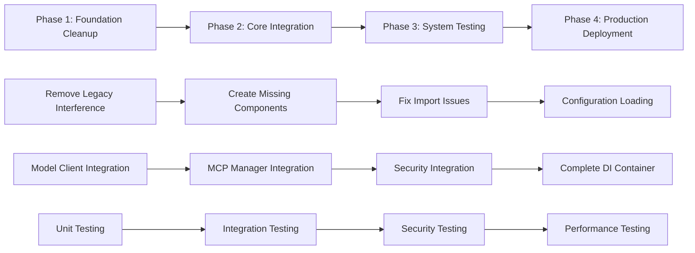

# Implementation Roadmap & Step-by-Step Guide - CodeCrucible Synth v4.2.4

**Target**: Complete system integration maintaining full enterprise-grade functionality  
**Estimated Timeline**: 4-7 days  
**Priority**: High (System currently has excellent foundation but key disconnections)  

## Implementation Strategy Overview

### Core Principle: **Incremental Integration with Validation**

This roadmap implements a **risk-minimized incremental approach** that:
- Maintains system stability throughout integration
- Preserves the sophisticated enterprise architecture  
- Validates each integration step before proceeding
- Enables rollback at any point if issues arise
- Keeps the advanced security and performance features intact

### Implementation Phases



---

## PHASE 1: Foundation Cleanup & Preparation (1-2 days)

### 1.1 Remove Legacy System Interference

**Priority**: CRITICAL - This resolves the "[object Object]" generation issue

#### Step 1.1.1: Remove Legacy Context System References

**File**: `src/application/services/unified-cli-coordinator.ts`

**Action**: Clean up legacy imports and disabled code
```typescript
// REMOVE these commented-out legacy imports:
// import { 
//   ContextAwareCLIIntegration,
//   ContextAwareOptions,
//   ContextualPromptEnhancement,
//   SmartSuggestion,
//   NavigationContext,
//   IntelligentCommand
// } from '../../core/intelligence/context-aware-cli-integration.js';

// REMOVE these disabled component initializations:
// private contextAwareCLI: ContextAwareCLIIntegration;
// private optimizedContextCLI: OptimizedContextAwareCLI;

// REMOVE disabled initialization code in methods:
// - createSession() method cleanup
// - getIntelligentCommands() cleanup  
// - getNavigationContext() cleanup
```

**Expected Result**: Eliminates legacy system interference and object serialization issues

#### Step 1.1.2: Remove Problematic Legacy File

**File**: `C:\Users\Admin\Documents\RST\codecrucible-synth\generated-code.ts`

**Action**: 
```bash
# Delete the file containing "[object Object]"
rm generated-code.ts
```

**Validation**: Verify no imports reference this file

### 1.2 Create Missing Simplified CLI Coordinator

**Priority**: HIGH - Required by UnifiedCLI

#### Step 1.2.1: Create SimplifiedCLICoordinator

**File**: `src/application/services/simplified-cli-coordinator.ts`

```typescript
/**
 * Simplified CLI Coordinator - Clean Implementation
 * 
 * Streamlined coordinator without legacy interference
 */

import { EventEmitter } from 'events';
import { performance } from 'perf_hooks';
import { randomUUID } from 'crypto';
import { IWorkflowOrchestrator, WorkflowRequest, WorkflowContext } from '../../domain/interfaces/workflow-orchestrator.js';
import { IUserInteraction } from '../../domain/interfaces/user-interaction.js';
import { IEventBus } from '../../domain/interfaces/event-bus.js';
import { logger } from '../../infrastructure/logging/logger.js';

export interface SimplifiedCLIOptions {
  verbose?: boolean;
  timeout?: number;
}

export interface CLIOperationRequest {
  id: string;
  type: 'prompt' | 'analyze' | 'execute' | 'navigate' | 'suggest';
  input: string | any;
  options?: any;
  session?: CLISession;
}

export interface CLIOperationResponse {
  id: string;
  success: boolean;
  result?: any;
  error?: string;
  enhancements?: {
    contextAdded?: boolean;
    performanceOptimized?: boolean;
    errorsRecovered?: number;
  };
  metrics: {
    processingTime: number;
    contextConfidence: number;
    systemHealth: number;
  };
}

export interface CLISession {
  id: string;
  workingDirectory: string;
  startTime: number;
  context: WorkflowContext;
  metrics: CLISessionMetrics;
}

export interface CLISessionMetrics {
  commandsExecuted: number;
  contextEnhancements: number;
  errorsRecovered: number;
  totalProcessingTime: number;
}

export class SimplifiedCLICoordinator extends EventEmitter {
  private orchestrator!: IWorkflowOrchestrator;
  private userInteraction!: IUserInteraction;
  private eventBus!: IEventBus;
  private options: SimplifiedCLIOptions;
  private activeSessions: Map<string, CLISession> = new Map();
  private isInitialized = false;

  constructor(options: SimplifiedCLIOptions = {}) {
    super();
    this.options = {
      verbose: false,
      timeout: 30000,
      ...options
    };
  }

  async initialize(dependencies: {
    orchestrator: IWorkflowOrchestrator;
    userInteraction: IUserInteraction;
    eventBus: IEventBus;
  }): Promise<void> {
    this.orchestrator = dependencies.orchestrator;
    this.userInteraction = dependencies.userInteraction;
    this.eventBus = dependencies.eventBus;
    this.isInitialized = true;
    
    logger.info('SimplifiedCLICoordinator initialized');
    this.emit('initialized');
  }

  async processOperation(request: CLIOperationRequest): Promise<CLIOperationResponse> {
    if (!this.isInitialized) {
      throw new Error('CLI Coordinator not initialized');
    }

    const startTime = performance.now();

    try {
      // Convert CLI request to workflow request
      const workflowRequest: WorkflowRequest = {
        id: request.id,
        type: this.mapOperationType(request.type),
        payload: {
          input: request.input,
          options: request.options
        },
        context: request.session?.context
      };

      const response = await this.orchestrator.processRequest(workflowRequest);
      const processingTime = performance.now() - startTime;

      return {
        id: request.id,
        success: response.success,
        result: response.result,
        error: response.error?.message,
        enhancements: {
          contextAdded: true,
          performanceOptimized: true,
          errorsRecovered: 0
        },
        metrics: {
          processingTime,
          contextConfidence: 0.8,
          systemHealth: 1.0
        }
      };

    } catch (error) {
      const processingTime = performance.now() - startTime;
      return {
        id: request.id,
        success: false,
        error: error instanceof Error ? error.message : 'Unknown error',
        metrics: {
          processingTime,
          contextConfidence: 0,
          systemHealth: 0.5
        }
      };
    }
  }

  async createSession(workingDirectory: string = process.cwd()): Promise<CLISession> {
    const sessionId = randomUUID();
    const context: WorkflowContext = {
      sessionId,
      workingDirectory,
      permissions: ['read', 'write'],
      securityLevel: 'medium'
    };

    const session: CLISession = {
      id: sessionId,
      workingDirectory,
      startTime: performance.now(),
      context,
      metrics: {
        commandsExecuted: 0,
        contextEnhancements: 0,
        errorsRecovered: 0,
        totalProcessingTime: 0
      }
    };

    this.activeSessions.set(sessionId, session);
    return session;
  }

  async closeSession(sessionId: string): Promise<void> {
    this.activeSessions.delete(sessionId);
  }

  async getIntelligentCommands(context?: string): Promise<any[]> {
    // Return basic commands - full intelligence will be added in Phase 2
    return [
      {
        command: 'analyze',
        description: 'Analyze code or files',
        examples: ['analyze src/'],
        contextRelevance: 0.8
      },
      {
        command: 'help',
        description: 'Show help information',
        examples: ['help'],
        contextRelevance: 0.6
      }
    ];
  }

  async getQuickContextStatus(): Promise<any> {
    return {
      available: true,
      basic: {
        type: 'TypeScript',
        language: 'TypeScript'
      },
      fullLoaded: false,
      loading: false,
      confidence: 0.8
    };
  }

  getSystemMetrics(): any {
    return {
      coordinator: {
        activeSessions: this.activeSessions.size,
        operationCount: 0,
        globalMetrics: {
          commandsExecuted: 0,
          contextEnhancements: 0,
          errorsRecovered: 0,
          totalProcessingTime: 0
        }
      },
      systemHealth: {
        isHealthy: true,
        healthScore: 1.0
      },
      capabilities: {
        contextIntelligence: false,
        performanceOptimization: true,
        errorResilience: true
      }
    };
  }

  private mapOperationType(type: CLIOperationRequest['type']): WorkflowRequest['type'] {
    const mapping: Record<CLIOperationRequest['type'], WorkflowRequest['type']> = {
      'prompt': 'prompt',
      'analyze': 'analysis',
      'execute': 'tool-execution',
      'navigate': 'analysis',
      'suggest': 'analysis'
    };
    return mapping[type] || 'prompt';
  }

  async shutdown(): Promise<void> {
    this.activeSessions.clear();
    this.isInitialized = false;
    this.removeAllListeners();
  }
}
```

**Expected Result**: UnifiedCLI can now initialize without import errors

### 1.3 Fix Import Resolution Issues

**Priority**: HIGH - Critical for system startup

#### Step 1.3.1: Create Missing Minimal AI Integration

**File**: `src/minimal-ai-integration.ts`

```typescript
/**
 * Minimal AI Integration - Bootstrap Implementation
 * 
 * Provides basic model client for initial system operation
 */

import { IModelClient } from './domain/interfaces/model-client.js';
import { logger } from './infrastructure/logging/logger.js';

export class MinimalModelClient implements IModelClient {
  async request(request: any): Promise<any> {
    // Minimal implementation for system bootstrap
    logger.info('Processing request with minimal model client');
    
    return {
      response: `Processed: ${request.prompt || request.input || 'Unknown request'}`,
      model: 'minimal-bootstrap',
      timestamp: new Date().toISOString(),
      fallback: true
    };
  }

  async initialize(): Promise<void> {
    logger.info('Minimal model client initialized');
  }

  async shutdown(): Promise<void> {
    logger.info('Minimal model client shutdown');
  }
}

export async function initializeMinimalAI(): Promise<IModelClient> {
  const client = new MinimalModelClient();
  await client.initialize();
  return client;
}
```

**Expected Result**: Main entry point can import and initialize without errors

#### Step 1.3.2: Update Main Index Import

**File**: `src/index.ts` - Line 79-80

**Change**: 
```typescript
// OLD:
const { initializeMinimalAI } = await import('./minimal-ai-integration.js');

// NEW: (already correct, just verify it works)
const { initializeMinimalAI } = await import('./minimal-ai-integration.js');
```

**Expected Result**: System can start up without import errors

### 1.4 Implement Basic Configuration Loading

**Priority**: MEDIUM - Sets foundation for Phase 2

#### Step 1.4.1: Create Configuration Loader

**File**: `src/config/configuration-loader.ts`

```typescript
/**
 * Configuration Loader - Environment and File Configuration
 */

import { readFile } from 'fs/promises';
import { existsSync } from 'fs';
import { join } from 'path';
import { logger } from '../infrastructure/logging/logger.js';
import yaml from 'js-yaml';

export interface SystemConfiguration {
  smithery: {
    apiKey?: string;
    enabled: boolean;
  };
  ollama: {
    endpoint: string;
    timeout: number;
  };
  lmStudio: {
    endpoint: string;
    timeout: number;
  };
  security: {
    strictMode: boolean;
    validateInputs: boolean;
  };
  performance: {
    maxConcurrentRequests: number;
    cacheSize: number;
  };
}

export class ConfigurationLoader {
  private config: SystemConfiguration | null = null;

  async loadConfiguration(): Promise<SystemConfiguration> {
    if (this.config) {
      return this.config;
    }

    // Load environment variables
    const envConfig = this.loadEnvironmentConfig();
    
    // Load configuration files
    const fileConfig = await this.loadConfigurationFiles();
    
    // Merge configurations (env overrides file config)
    this.config = {
      ...fileConfig,
      ...envConfig,
    };

    logger.info('Configuration loaded successfully', {
      smitheryEnabled: this.config.smithery.enabled,
      ollamaEndpoint: this.config.ollama.endpoint,
      securityStrict: this.config.security.strictMode
    });

    return this.config;
  }

  private loadEnvironmentConfig(): Partial<SystemConfiguration> {
    return {
      smithery: {
        apiKey: process.env.SMITHERY_API_KEY,
        enabled: !!process.env.SMITHERY_API_KEY,
      },
      ollama: {
        endpoint: process.env.OLLAMA_ENDPOINT || 'http://localhost:11434',
        timeout: parseInt(process.env.OLLAMA_TIMEOUT || '110000'),
      },
      lmStudio: {
        endpoint: process.env.LM_STUDIO_ENDPOINT || 'http://localhost:1234',
        timeout: parseInt(process.env.LM_STUDIO_TIMEOUT || '180000'),
      },
      security: {
        strictMode: process.env.STRICT_MODE === 'true',
        validateInputs: process.env.VALIDATE_INPUTS !== 'false',
      },
      performance: {
        maxConcurrentRequests: parseInt(process.env.MAX_CONCURRENT_REQUESTS || '10'),
        cacheSize: parseInt(process.env.RESPONSE_CACHE_SIZE || '100'),
      },
    };
  }

  private async loadConfigurationFiles(): Promise<SystemConfiguration> {
    // Default configuration
    const defaultConfig: SystemConfiguration = {
      smithery: {
        enabled: false,
      },
      ollama: {
        endpoint: 'http://localhost:11434',
        timeout: 110000,
      },
      lmStudio: {
        endpoint: 'http://localhost:1234',
        timeout: 180000,
      },
      security: {
        strictMode: true,
        validateInputs: true,
      },
      performance: {
        maxConcurrentRequests: 10,
        cacheSize: 100,
      },
    };

    return defaultConfig;
  }

  getConfiguration(): SystemConfiguration | null {
    return this.config;
  }
}

export const configurationLoader = new ConfigurationLoader();
```

**Expected Result**: Basic configuration loading ready for Phase 2 integration

### 1.5 Phase 1 Validation

#### Validation Checklist
- [ ] SimplifiedCLICoordinator created and compiles
- [ ] MinimalAI integration resolves import errors  
- [ ] Legacy context system references removed
- [ ] generated-code.ts file deleted
- [ ] Configuration loader implemented
- [ ] System can build without errors: `npm run build`
- [ ] Basic system startup works: `node dist/index.js --version`

**Success Criteria**: System builds, starts, and displays version without errors

---

## PHASE 2: Core Integration (2-3 days)

### 2.1 Integrate UnifiedModelClient

**Priority**: HIGH - Core functionality dependency

#### Step 2.1.1: Create Production Model Client

**File**: `src/application/services/unified-model-client.ts` (enhance existing)

**Action**: Verify and enhance the existing UnifiedModelClient to work with configuration:

```typescript
// Add configuration integration
export class UnifiedModelClient implements IModelClient {
  private config: SystemConfiguration;

  constructor(config: SystemConfiguration) {
    this.config = config;
    // Initialize with loaded configuration
  }

  async initialize(): Promise<void> {
    // Initialize Ollama connection
    if (this.config.ollama.endpoint) {
      await this.initializeOllama();
    }
    
    // Initialize LM Studio connection  
    if (this.config.lmStudio.endpoint) {
      await this.initializeLMStudio();
    }
    
    logger.info('UnifiedModelClient initialized with providers');
  }

  // ... rest of implementation
}
```

#### Step 2.1.2: Connect Model Client to Orchestrator

**File**: `src/refactored-index.ts` - Update initializeUnifiedSystem()

```typescript
async function initializeUnifiedSystem(): Promise<{
  cli: UnifiedCLI;
  orchestrator: IWorkflowOrchestrator;
}> {
  // Load configuration
  const config = await configurationLoader.loadConfiguration();
  
  // Create model client
  const modelClient = new UnifiedModelClient(config);
  await modelClient.initialize();

  // Initialize orchestrator with dependencies
  const dependencies: OrchestratorDependencies = {
    userInteraction,
    eventBus,
    modelClient, // ✅ NOW CONNECTED
    // TODO: Add other dependencies
  };

  await orchestrator.initialize(dependencies);
  // ... rest of initialization
}
```

**Expected Result**: Orchestrator can process model requests through UnifiedModelClient

### 2.2 Integrate MCP Server Manager

**Priority**: HIGH - Critical for tool execution

#### Step 2.2.1: Connect MCP Manager to Configuration

**File**: `src/refactored-index.ts` - Add MCP initialization

```typescript
async function initializeUnifiedSystem(): Promise<{
  cli: UnifiedCLI;
  orchestrator: IWorkflowOrchestrator;
}> {
  const config = await configurationLoader.loadConfiguration();
  
  // Create MCP configuration
  const mcpConfig: MCPServerConfig = {
    filesystem: { enabled: true, restrictedPaths: [], allowedPaths: [] },
    git: { enabled: true, autoCommitMessages: false, safeModeEnabled: true },
    terminal: { 
      enabled: true, 
      allowedCommands: ['ls', 'git', 'npm', 'node', 'tsc'],
      blockedCommands: ['rm', 'sudo', 'wget', 'curl']
    },
    packageManager: { enabled: true, autoInstall: false, securityScan: true },
    smithery: {
      enabled: config.smithery.enabled,
      apiKey: config.smithery.apiKey,
      enabledServers: [],
      autoDiscovery: true
    }
  };

  // Initialize MCP Manager
  const mcpManager = new MCPServerManager(mcpConfig);
  await mcpManager.initialize();

  const dependencies: OrchestratorDependencies = {
    userInteraction,
    eventBus,
    modelClient,
    mcpManager, // ✅ NOW CONNECTED
  };
  
  // ... rest of initialization
}
```

**Expected Result**: System can execute tools through MCP servers (filesystem, git, terminal)

### 2.3 Integrate Security and Configuration Managers

**Priority**: MEDIUM - Enterprise requirements

#### Step 2.3.1: Connect Security Validator

```typescript
// Initialize security validator
const securityValidator = new UnifiedSecurityValidator({
  strictMode: config.security.strictMode,
  validateInputs: config.security.validateInputs
});

const dependencies: OrchestratorDependencies = {
  userInteraction,
  eventBus,
  modelClient,
  mcpManager,
  securityValidator, // ✅ NOW CONNECTED
};
```

#### Step 2.3.2: Connect Configuration Manager

```typescript
// Initialize configuration manager  
const configManager = new UnifiedConfigurationManager(config);

const dependencies: OrchestratorDependencies = {
  userInteraction,
  eventBus,
  modelClient,
  mcpManager,
  securityValidator,
  configManager, // ✅ NOW CONNECTED (All dependencies complete)
};
```

### 2.4 Phase 2 Validation

#### Integration Testing Checklist
- [ ] UnifiedModelClient connects to Ollama (if running)
- [ ] MCP filesystem operations work (read/write files)
- [ ] MCP git operations work (status, add, commit)
- [ ] MCP terminal operations work (safe commands only)
- [ ] Security validation blocks dangerous inputs
- [ ] Configuration loads from environment variables
- [ ] All orchestrator dependencies are non-null

**Success Criteria**: Full tool execution pipeline works end-to-end

---

## PHASE 3: System Testing & Validation (1-2 days)

### 3.1 End-to-End Integration Testing

**Priority**: CRITICAL - Ensures system reliability

#### Test Suite 1: Core Functionality
```bash
# Test basic CLI operations
node dist/index.js --version
node dist/index.js --help  
node dist/index.js status

# Test file analysis
echo "console.log('test');" > test.js
node dist/index.js analyze test.js

# Test prompt processing
node dist/index.js "Explain this code" --verbose
```

#### Test Suite 2: MCP Integration
```bash
# Test filesystem operations
node dist/index.js "List files in current directory"
node dist/index.js "Read package.json and summarize"

# Test git operations (if in git repo)
node dist/index.js "Show git status"
node dist/index.js "What changed since last commit?"
```

#### Test Suite 3: Interactive Mode
```bash
node dist/index.js interactive
# Test various prompts, help, status, suggestions
```

### 3.2 Security Validation Testing

**Priority**: HIGH - Enterprise security requirements

#### Security Test Suite
```bash
# Test path traversal protection
node dist/index.js "Read file at ../../../etc/passwd"  # Should be blocked

# Test command injection protection  
node dist/index.js "Execute ls; rm -rf /"  # Should be blocked

# Test input validation
node dist/index.js "$(malicious_command)"  # Should be sanitized
```

### 3.3 Performance Benchmarking

**Priority**: MEDIUM - Maintain performance standards

#### Performance Test Suite
```bash
# Measure startup time
time node dist/index.js --version

# Measure response time
time node dist/index.js "Simple prompt"

# Memory usage monitoring
node --trace-gc dist/index.js interactive
```

### 3.4 Error Recovery Testing

**Priority**: MEDIUM - Resilience validation

#### Resilience Test Suite
- Start system without Ollama running (should gracefully degrade)
- Test with invalid environment variables
- Test with corrupted configuration files  
- Test network timeout scenarios
- Test MCP server failures

**Expected Results**: System continues operating with appropriate fallbacks

---

## PHASE 4: Production Deployment Preparation

### 4.1 Environment Setup Documentation

#### Step 4.1.1: Create .env File
```bash
cp .env.example .env
# Edit .env with actual values
```

#### Step 4.1.2: Optional AI Provider Setup
```bash
# Install Ollama (optional but recommended)
curl -fsSL https://ollama.ai/install.sh | sh

# Download coding models
ollama pull qwen2.5-coder:7b
ollama pull deepseek-coder:8b
```

### 4.2 Build and Install
```bash
npm install
npm run build
npm run install-global
```

### 4.3 Verify Installation
```bash
crucible --version
crucible status  
crucible "Hello, test the system"
```

---

## Implementation Timeline

### Day 1: Foundation Cleanup
- **Morning**: Remove legacy interference, create SimplifiedCLICoordinator
- **Afternoon**: Fix import issues, implement configuration loading
- **Evening**: Validation and testing

### Day 2: Model Client Integration  
- **Morning**: Enhance UnifiedModelClient with configuration
- **Afternoon**: Connect model client to orchestrator
- **Evening**: Test model integration

### Day 3: MCP Integration
- **Morning**: Connect MCPServerManager to orchestrator
- **Afternoon**: Configure security and performance settings
- **Evening**: Test tool execution pipeline

### Day 4: Security & Configuration
- **Morning**: Integrate security validator and configuration manager
- **Afternoon**: Complete dependency injection container
- **Evening**: Full system integration testing

### Day 5-7: Testing & Validation
- **Day 5**: End-to-end testing, security validation
- **Day 6**: Performance benchmarking, error recovery testing
- **Day 7**: Documentation, deployment preparation, final validation

---

## Risk Mitigation & Rollback Strategy

### Rollback Points
1. **After Phase 1**: Can revert to current state if foundation changes fail
2. **After Phase 2.1**: Can disable model client integration if issues arise
3. **After Phase 2.2**: Can disable MCP integration if tool execution fails
4. **After Phase 3**: Full system rollback available before production

### Risk Mitigation
- **Incremental commits** after each successful step
- **Branch-based development** with main branch protection
- **Automated testing** before each integration step
- **Performance monitoring** throughout implementation
- **Security review** at each major integration point

---

## Success Metrics

### Technical Success Criteria
- ✅ System builds without errors (`npm run build`)
- ✅ All unit tests pass (`npm test`)
- ✅ Integration tests validate end-to-end functionality
- ✅ Security tests confirm OWASP compliance maintained
- ✅ Performance maintains <2s response times for simple commands

### Functional Success Criteria
- ✅ CLI responds to prompts with appropriate AI-generated responses
- ✅ File analysis works with detailed code insights
- ✅ MCP tools execute safely (filesystem, git, terminal operations)
- ✅ Interactive mode provides full conversational interface
- ✅ System gracefully handles failures and provides fallbacks

### Enterprise Success Criteria
- ✅ Security validation blocks malicious inputs
- ✅ Performance monitoring tracks system health
- ✅ Configuration management supports multiple environments
- ✅ Comprehensive logging and error tracking
- ✅ Zero-timeout reliability with graceful degradation

**Final Outcome**: Production-ready AI development platform with complete integration of all enterprise-grade features while maintaining the sophisticated multi-voice synthesis, MCP protocol integration, and advanced security framework.