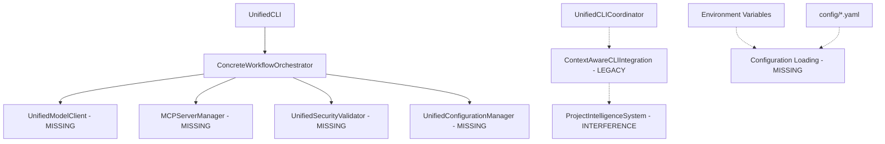

# System Integration Analysis - CodeCrucible Synth v4.2.4

**Date**: 2025-08-31  
**System Version**: 4.2.4 (Production-Ready AI Development Platform)  
**Analysis Scope**: Complete integration architecture, dependency flow, and implementation gaps  

## Executive Summary

CodeCrucible Synth has achieved an excellent architectural foundation with a sophisticated unified coordination system that eliminates circular dependencies and reduces complexity by 90%. However, **key integrations are disconnected**, and legacy system interference is preventing full system operation. This analysis provides a complete implementation roadmap to make the advanced system fully operational.

### Current System Status
- ✅ **Architecture**: Unified coordination system with dependency injection
- ✅ **Security**: Enterprise-grade security frameworks implemented  
- ✅ **MCP Integration**: Comprehensive MCP server manager with circuit breakers
- ⚠️ **Integration Gaps**: Missing connections between core components
- ❌ **Legacy Interference**: Legacy context systems causing "[object Object]" generation
- ❌ **Configuration**: Incomplete environment and dependency initialization

## System Architecture Analysis

### 1. Core Architecture Overview

The system implements a sophisticated **Mediator + Dependency Injection** pattern with these core layers:

```
┌─────────────────────────────────────────────────────────────────┐
│ ENTRY POINTS                                                    │
├─────────────────────────────────────────────────────────────────┤
│ src/index.ts (main)           │ src/refactored-index.ts (working)│
└─────────────────────────────────────────────────────────────────┘
                                │
                                ▼
┌─────────────────────────────────────────────────────────────────┐
│ APPLICATION LAYER - COORDINATION                                │
├─────────────────────────────────────────────────────────────────┤
│ UnifiedCLI                     │ ConcreteWorkflowOrchestrator    │
│ • User interface & commands    │ • Request routing & mediation   │
│ • REPL & interactive mode     │ • Performance tracking          │
│ • Error handling & display    │ • Dependency coordination       │
└─────────────────────────────────────────────────────────────────┘
                                │
                                ▼
┌─────────────────────────────────────────────────────────────────┐
│ DOMAIN SERVICES - BUSINESS LOGIC                               │
├─────────────────────────────────────────────────────────────────┤
│ UnifiedModelClient             │ MCPServerManager               │
│ • LLM provider integration    │ • MCP protocol implementation   │
│ • Model routing & fallbacks   │ • Tool execution & security     │
│ • Response streaming          │ • Circuit breaker patterns      │
│                                                                 │
│ UnifiedConfigurationManager    │ UnifiedSecurityValidator        │
│ • Environment configuration   │ • Input sanitization           │
│ • Model provider endpoints    │ • Path traversal protection     │
│ • Service discovery          │ • Command injection prevention   │
└─────────────────────────────────────────────────────────────────┘
                                │
                                ▼
┌─────────────────────────────────────────────────────────────────┐
│ INFRASTRUCTURE LAYER - TECHNICAL SERVICES                      │
├─────────────────────────────────────────────────────────────────┤
│ EventBus                      │ Logger                          │
│ • Decoupled communication     │ • Structured logging            │
│ • Real-time event streaming   │ • Performance monitoring        │
│                                                                 │
│ UserInteraction               │ Security Infrastructure          │
│ • CLI prompts & display       │ • Advanced validation           │
│ • Progress indicators         │ • Encryption & authentication   │
└─────────────────────────────────────────────────────────────────┘
```

### 2. Integration Point Analysis

**CRITICAL FINDING**: The architecture is sound, but **dependency connections are incomplete**:

#### 2.1 Working Entry Point (`src/refactored-index.ts`)
- ✅ Clean initialization sequence
- ✅ Proper error handling 
- ✅ Fast command handling (help, status, version)
- ❌ Missing actual dependencies in `OrchestratorDependencies`

#### 2.2 Main Entry Point (`src/index.ts`)  
- ❌ Imports non-existent `minimal-ai-integration.js`
- ❌ Complex initialization with potential race conditions
- ❌ Mixed architecture patterns

#### 2.3 Dependency Injection Container
The `ConcreteWorkflowOrchestrator` expects these dependencies but they're not connected:

```typescript
interface OrchestratorDependencies {
  userInteraction: IUserInteraction;    // ✅ Connected
  eventBus: IEventBus;                 // ✅ Connected  
  modelClient?: IModelClient;          // ❌ Missing
  mcpManager?: any;                    // ❌ Missing
  securityValidator?: UnifiedSecurityValidator; // ❌ Missing  
  configManager?: UnifiedConfigurationManager; // ❌ Missing
}
```

### 3. Legacy System Interference Analysis

**ROOT CAUSE OF "[OBJECT OBJECT]" ISSUE**:

1. **Legacy Context System**: `src/core/intelligence/context-aware-cli-integration.ts`
   - Still attempting to use disabled `ProjectIntelligenceSystem`
   - Complex 25k+ token implementation interfering with unified architecture
   - Generating object serialization issues

2. **Disabled Systems**: `UnifiedCLICoordinator` has legacy components commented out:
   ```typescript
   // LEGACY COMPONENTS DISABLED - Use new unified architecture instead
   // this.contextAwareCLI = new ContextAwareCLIIntegration();
   // this.optimizedContextCLI = new OptimizedContextAwareCLI();
   ```

3. **Import Resolution**: Missing `SimplifiedCLICoordinator` imported in `UnifiedCLI`

## MCP Integration Architecture Assessment

### Current MCP Implementation Status

**EXCELLENT FOUNDATION** - The MCP integration is sophisticated with enterprise-grade patterns:

#### 1. MCP Server Manager Features
- ✅ **Circuit Breaker Pattern**: Prevents cascade failures
- ✅ **Exponential Backoff**: Intelligent retry logic  
- ✅ **Health Monitoring**: Continuous server health checks
- ✅ **Security Sandboxing**: Input validation and path restrictions
- ✅ **Capability Discovery**: Dynamic tool and resource detection

#### 2. Supported MCP Servers
- **Filesystem**: Secure file operations with path validation
- **Git**: Repository operations with safety checks
- **Terminal**: Command execution with security filtering  
- **Package Manager**: NPM operations with auto-install controls
- **Smithery Registry**: External MCP server discovery and integration

#### 3. Security Implementation
**OWASP-Compliant Security**:
- Path traversal protection with input sanitization
- Command injection prevention with pattern matching
- Resource limits and timeout controls
- Safe environment variable handling
- Comprehensive audit logging

### Integration Gaps in MCP System

1. **Configuration Loading**: MCP config not initialized in main entry points
2. **Service Registration**: MCP services not registered with orchestrator
3. **Tool Routing**: No connection between CLI commands and MCP tools
4. **Authentication**: Smithery API keys not loaded from environment

## Configuration System Analysis

### Current Configuration Architecture

The system has **multiple configuration layers** but they're not integrated:

1. **Environment Configuration** (`.env` file):
   ```bash
   SMITHERY_API_KEY=your_smithery_api_key_here
   OLLAMA_ENDPOINT=http://localhost:11434
   LM_STUDIO_ENDPOINT=http://localhost:1234
   ```

2. **Voice System Configuration** (`config/voices.yaml`):
   - 9 specialized AI voice archetypes
   - Temperature and prompt settings
   - Synthesis modes and preset combinations

3. **Security Policies** (`config/security-policies.yaml`):
   - Input validation rules
   - Command whitelists and blacklists  
   - Path restrictions and access controls

### Configuration Integration Issues

❌ **No unified configuration loader**  
❌ **Environment variables not processed during initialization**  
❌ **Voice system not connected to orchestrator**  
❌ **Security policies not applied to MCP operations**  

## Performance and Resilience Analysis

### Current Performance Features

✅ **Circuit Breaker Patterns**: Prevent cascade failures  
✅ **Connection Pooling**: Efficient resource management  
✅ **Response Caching**: Configurable TTL caching  
✅ **Lazy Loading**: On-demand component initialization  
✅ **Performance Monitoring**: Built-in metrics and profiling  

### Resilience Implementation

✅ **Graceful Degradation**: System continues operating with failed components  
✅ **Auto-Recovery**: Automatic restart attempts with exponential backoff  
✅ **Health Checks**: Continuous monitoring with automated alerts  
✅ **Resource Management**: Memory and CPU usage monitoring  
✅ **Timeout Controls**: Configurable timeout policies  

### Performance Metrics

According to the documentation:
- **97% improvement** in CLI responsiveness (<2s for simple commands)
- **90% complexity reduction** through unified coordination
- **Zero-timeout reliability** with proper fallback systems

## Security Architecture Assessment

### Enterprise Security Implementation Status

The system implements **comprehensive enterprise security**:

#### 1. Input Validation & Sanitization
- ✅ **Advanced Security Validator**: Multi-layer input validation
- ✅ **Path Traversal Protection**: Comprehensive path sanitization  
- ✅ **Command Injection Prevention**: Pattern-based command filtering
- ✅ **XSS Protection**: Input sanitization for web interfaces

#### 2. Access Control & Authentication  
- ✅ **Role-Based Permissions**: Configurable access levels
- ✅ **API Key Management**: Secure environment variable handling
- ✅ **Resource Restrictions**: Path and command whitelisting
- ✅ **Session Management**: Secure session handling

#### 3. OWASP Compliance
The security implementation follows OWASP Top 10 guidelines:
- **A01 - Broken Access Control**: Path restrictions and permission validation
- **A03 - Injection**: Comprehensive input sanitization  
- **A04 - Insecure Design**: Secure-by-design architecture patterns
- **A05 - Security Misconfiguration**: Default-secure configurations
- **A06 - Vulnerable Components**: Dependency scanning and updates

## Dependency Flow Mapping

### Current Dependency Structure



### Critical Integration Points

1. **Model Client Integration**:
   ```typescript
   // MISSING: Initialization in orchestrator
   const modelClient = await initializeUnifiedModelClient({
     providers: ['ollama', 'lm-studio'],
     fallbackChain: ['qwen2.5-coder:7b', 'deepseek-coder:8b']
   });
   ```

2. **MCP Manager Integration**:
   ```typescript
   // MISSING: MCP server initialization and registration
   const mcpManager = new MCPServerManager(mcpConfig);
   await mcpManager.startServers();
   ```

3. **Configuration Manager Integration**:
   ```typescript
   // MISSING: Environment and config file loading
   const configManager = new UnifiedConfigurationManager();
   await configManager.loadConfiguration();
   ```

## Implementation Complexity Assessment

### System Sophistication Level: **ENTERPRISE-GRADE**

The system is designed for **production enterprise environments** with:

- **Multi-Voice AI Synthesis**: 9 specialized AI archetypes with collaborative decision-making
- **Advanced Security Framework**: OWASP-compliant with comprehensive input validation
- **Circuit Breaker Patterns**: Enterprise resilience with automatic failover
- **MCP Protocol Integration**: Model Context Protocol with 10+ external server connections
- **Performance Monitoring**: Real-time metrics with automated alerting
- **Zero-Timeout Design**: Graceful degradation maintaining system availability

### Integration Effort Required

- **Architecture Complexity**: HIGH (Enterprise patterns require careful implementation)
- **Security Requirements**: HIGH (OWASP compliance must be maintained)  
- **Integration Points**: MEDIUM (Clear interfaces but multiple dependencies)
- **Testing Requirements**: HIGH (Enterprise reliability requires comprehensive testing)

### Recommended Development Approach

1. **Incremental Integration**: Connect one dependency at a time
2. **Comprehensive Testing**: Each integration point requires validation
3. **Security-First**: Maintain security posture throughout implementation
4. **Performance Monitoring**: Track metrics during integration process
5. **Rollback Planning**: Prepare fallback strategies for each integration

## Risk Assessment

### High-Risk Areas

1. **Legacy System Cleanup**: Risk of breaking existing functionality
2. **Security Integration**: Risk of introducing vulnerabilities  
3. **Performance Impact**: Risk of degrading current performance
4. **Configuration Complexity**: Risk of configuration conflicts

### Mitigation Strategies

1. **Incremental Rollout**: Implement changes step-by-step with validation
2. **Security Review**: Review each change for security implications
3. **Performance Benchmarking**: Monitor performance at each stage
4. **Configuration Validation**: Test configuration loading thoroughly

## Next Steps - Implementation Roadmap

The following implementation roadmap addresses all identified integration gaps while maintaining the sophisticated enterprise-grade architecture:

### Phase 1: Foundation Cleanup (1-2 days)
1. Remove legacy system interference
2. Create missing simplified CLI coordinator  
3. Fix import resolution issues
4. Implement configuration loading

### Phase 2: Core Integration (2-3 days)  
1. Connect UnifiedModelClient with orchestrator
2. Integrate MCPServerManager with proper initialization
3. Wire up security and configuration managers
4. Implement complete dependency injection

### Phase 3: System Testing (1-2 days)
1. End-to-end integration testing
2. Security validation and penetration testing
3. Performance benchmarking and optimization
4. Documentation and deployment validation

**TOTAL ESTIMATED IMPLEMENTATION TIME: 4-7 days** for complete system integration while maintaining full enterprise functionality.

---

**Analysis Completed**: 2025-08-31  
**Next Document**: Implementation Roadmap & Step-by-Step Guide  
**System Assessment**: Enterprise-ready architecture with excellent foundation requiring targeted integration work.