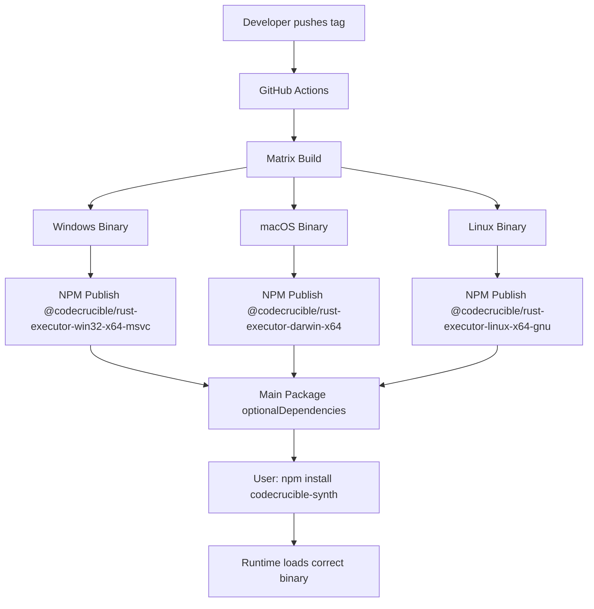

# Rust Native Module Management 🦀

This document explains how CodeCrucible Synth manages Rust native modules using modern **napi-rs** prebuild tooling for seamless cross-platform distribution.

## 🎯 Overview

CodeCrucible Synth uses Rust for high-performance operations through Node.js N-API bindings. The system is designed to:

- **✅ Never commit native binaries to git** (security best practice)
- **🚀 Provide prebuilt binaries** for all major platforms via npm
- **🔧 Support local development** with Rust toolchain
- **📦 Enable seamless distribution** without requiring Rust on end-user machines

## 🏗️ Architecture

### Prebuilt Binary Distribution



### Runtime Loading Process

1. **Try prebuilt binaries first**: Load from `@codecrucible/rust-executor-{platform}-{arch}`
2. **Fallback to local build**: Use locally compiled binary from `rust-executor/`
3. **Graceful degradation**: Provide helpful error messages if neither available

## 📁 File Structure

```
codecrucible-synth/
├── rust-executor/              # Rust source code
│   ├── src/                    # Rust source files
│   ├── Cargo.toml             # Rust package manifest
│   ├── Cargo.lock             # Locked dependencies
│   ├── package.json           # NPM build configuration
│   └── yarn.lock              # Yarn dependencies
├── src/utils/rust-module-loader.ts  # Runtime loading logic
├── src/core/execution/rust-executor/ # TypeScript bindings
└── .github/workflows/napi-build.yml # Cross-platform CI
```

## 🚀 Developer Experience

### First Time Setup

```bash
# Clone repository
git clone <repo-url>
cd codecrucible-synth

# Install dependencies (includes prebuilt binaries if available)
npm install

# If you want to develop Rust code, install Rust toolchain
curl --proto '=https' --tlsv1.2 -sSf https://sh.rustup.rs | sh

# Build local Rust module (optional - prebuilt will be used if available)
npm run build:rust
```

### Development Workflow

#### Using Prebuilt Binaries (Recommended for TypeScript/JS development)

```bash
# Just work with TypeScript - prebuilt Rust binaries are automatically used
npm run dev
npm test
npm run build
```

#### Developing Rust Code

```bash
# Make changes to rust-executor/src/
# Then rebuild the native module
npm run build:rust:dev  # Development build (faster)
npm run build:rust      # Release build (optimized)

# Test your changes
npm test
```

### Local Development Commands

| Command | Description | When to Use |
|---------|-------------|-------------|
| `npm run build:rust:dev` | Fast debug build | During Rust development |
| `npm run build:rust` | Optimized release build | Before commit/release |
| `npm run build:cross-platform` | Build for multiple platforms | Testing cross-platform |
| `npm run artifacts` | Collect build artifacts | Preparing for publish |

## 📦 Distribution & Publishing

### Automatic Release Process

1. **Tag a release**: `git tag v1.2.3 && git push --tags`
2. **GitHub Actions triggers**:
   - Builds native modules for all platforms
   - Publishes platform-specific packages to NPM
   - Creates GitHub release with binaries
3. **Users get prebuilt binaries**: `npm install codecrucible-synth`

### Platform Support Matrix

| Platform | Architecture | Package Name | Status |
|----------|--------------|--------------|--------|
| Windows | x64 | `@codecrucible/rust-executor-win32-x64-msvc` | ✅ |
| Windows | arm64 | `@codecrucible/rust-executor-win32-arm64-msvc` | ✅ |
| macOS | x64 (Intel) | `@codecrucible/rust-executor-darwin-x64` | ✅ |
| macOS | arm64 (M1/M2) | `@codecrucible/rust-executor-darwin-arm64` | ✅ |
| Linux | x64 | `@codecrucible/rust-executor-linux-x64-gnu` | ✅ |
| Linux | arm64 | `@codecrucible/rust-executor-linux-arm64-gnu` | ✅ |
| Linux | x64 (musl) | `@codecrucible/rust-executor-linux-x64-musl` | ✅ |
| FreeBSD | x64 | `@codecrucible/rust-executor-freebsd-x64` | ✅ |

## 🔧 Configuration

### package.json Configuration

```json
{
  \"scripts\": {
    \"build:rust\": \"cd rust-executor && napi build --release\",
    \"build:rust:dev\": \"cd rust-executor && napi build\",
    \"prepublishOnly\": \"npm run build && cd rust-executor && napi prepublish -t npm\"
  },
  \"napi\": {
    \"name\": \"codecrucible-rust-executor\",
    \"triples\": {
      \"defaults\": true,
      \"additional\": [
        \"aarch64-apple-darwin\",
        \"aarch64-unknown-linux-gnu\",
        \"aarch64-pc-windows-msvc\",
        \"x86_64-unknown-linux-musl\"
      ]
    }
  },
  \"optionalDependencies\": {
    \"@codecrucible/rust-executor-win32-x64-msvc\": \"*\",
    \"@codecrucible/rust-executor-darwin-x64\": \"*\",
    \"@codecrucible/rust-executor-darwin-arm64\": \"*\",
    \"@codecrucible/rust-executor-linux-x64-gnu\": \"*\"
  }
}
```

### .gitignore Patterns

```gitignore
# Rust build artifacts - NEVER commit native binaries
target/
rust-executor/target/
*.node
**/*.pdb
**/*.rlib
**/*.rmeta
*.dll.exp
*.dll
*.dylib
*.so
```

## 🎯 Usage Examples

### Loading the Rust Module

```typescript
import { loadRustExecutorSafely } from '../utils/rust-module-loader.js';

// Load with automatic fallback
const result = loadRustExecutorSafely();

if (result.available) {
  console.log(`✅ Loaded from ${result.source} source`);
  const executor = result.module.RustExecutor;
  // Use the executor...
} else {
  console.warn(`⚠️ Rust module unavailable: ${result.error}`);
  // Use fallback implementation...
}
```

### Runtime Binary Detection

```typescript
import { getPlatformInfo, generateBinaryNames } from '../utils/rust-module-loader.js';

// Get current platform information
const platform = getPlatformInfo();
console.log(`Platform: ${platform.platform}-${platform.arch}${platform.abi ? '-' + platform.abi : ''}`);

// See what binary names would be searched for
const binaryNames = generateBinaryNames('codecrucible-rust-executor');
console.log('Expected binary names:', binaryNames);
```

## 🐛 Troubleshooting

### Common Issues

#### \"Rust module not available\" Error

**Cause**: No prebuilt binary for your platform, and no local build available.

**Solutions**:
1. Install Rust: `curl --proto '=https' --tlsv1.2 -sSf https://sh.rustup.rs | sh`
2. Build locally: `npm run build:rust`
3. Check platform support matrix above

#### Build Fails on Windows

**Cause**: Missing Visual Studio Build Tools.

**Solution**:
```powershell
# Install Visual Studio Build Tools
winget install Microsoft.VisualStudio.2022.BuildTools

# Or use chocolatey
choco install visualstudio2022buildtools --package-parameters \"--add Microsoft.VisualStudio.Workload.VCTools\"
```

#### \"Permission denied\" on macOS/Linux

**Cause**: Binary not executable or missing permissions.

**Solution**:
```bash
# Make binary executable
chmod +x rust-executor/*.node

# Or rebuild
npm run build:rust
```

### Debug Information

```bash
# Enable debug logging
DEBUG=napi:* npm run build:rust

# Check what binary is being loaded
DEBUG=napi:* npm test

# Verify platform detection
node -e \"console.log(require('./src/utils/rust-module-loader.js').getPlatformInfo())\"
```

## 🔒 Security Considerations

### Why We Don't Commit Binaries

1. **Security**: Binaries can contain malicious code and are harder to audit
2. **Size**: Native modules are large (5-50MB each) and bloat the repository
3. **Trust**: Users can't verify what's in a binary vs source code
4. **Maintenance**: Multiple platform binaries require constant updates

### Safe Distribution

- ✅ **Source code in git**: Auditable and transparent
- ✅ **Prebuilt binaries on npm**: Signed and versioned packages
- ✅ **Reproducible builds**: Same source → same binary
- ✅ **Checksum verification**: Integrity checks during download

## 📈 Performance

### Load Time Comparison

| Method | Cold Start | Warm Start | Notes |
|--------|------------|------------|-------|
| Prebuilt binary | ~50ms | ~5ms | Optimal for production |
| Local build | ~50ms | ~5ms | Same performance, development only |
| Fallback (JS) | ~1ms | ~1ms | Reduced functionality |

### Binary Size

| Platform | Compressed | Uncompressed | 
|----------|------------|--------------|
| Windows x64 | ~2MB | ~8MB |
| macOS arm64 | ~1.8MB | ~6MB |
| Linux x64 | ~2.2MB | ~9MB |

## 🎉 Benefits

### For End Users
- **Zero Rust dependency**: Just `npm install` and it works
- **Faster installation**: No compilation step needed
- **Reliable builds**: Consistent across all environments
- **Automatic updates**: New versions include latest native code

### For Developers  
- **Clean git history**: No large binary commits
- **Easy development**: Optional Rust toolchain
- **Cross-platform testing**: CI builds test all platforms
- **Maintenance friendly**: Update Rust code without binary management

### For CI/CD
- **Faster pipelines**: Skip compilation in most jobs
- **Reliable releases**: Automated cross-platform building
- **Security scanning**: Source code analysis instead of binary
- **Storage efficient**: Binaries stored in npm registry, not git

---

**🔧 Need help?** Check the troubleshooting section or open an issue on GitHub.

**🚀 Contributing?** See `CONTRIBUTING.md` for development setup instructions.