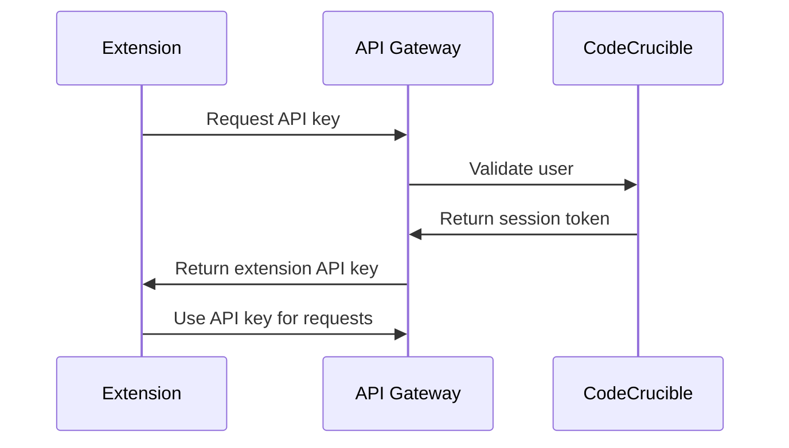

# CodeCrucible Extensions & Plugins

This directory contains all IDE and editor extensions for integrating CodeCrucible's multi-voice AI platform directly into developer workflows.

## Architecture Overview

CodeCrucible extensions follow a modular architecture with these core components:

### 1. Extension API Gateway (`/server/extension-api/`)
- Centralized authentication and rate limiting
- Standardized API interface for all extensions
- Telemetry and usage analytics
- Error handling and logging

### 2. Platform-Specific Extensions (`/extensions/*/`)
- Platform-native UI components
- Local context extraction
- Real-time streaming integration
- Offline caching capabilities

### 3. Shared Libraries (`/extensions/shared/`)
- Common authentication logic
- API client implementations
- Utility functions and constants
- TypeScript type definitions

## Available Extensions

### 🐙 GitHub Integration (`/github/`)
**Status**: 🚧 In Development

Multi-voice code review and quality assessment for GitHub repositories.

**Features**:
- Pull request council analysis
- Automated commit review
- Issue triage recommendations
- Code quality gates

**Installation**: Available on GitHub Marketplace

### 💻 VS Code Extension (`/vscode/`)
**Status**: 🚧 In Development

Full-featured IDE integration with sidebar panels and inline commands.

**Features**:
- Council generation sidebar
- Inline code generation
- Real-time synthesis view
- Decision history tracking

**Installation**: `ext install codecrucible.multi-voice-ai`

### 🧠 JetBrains Plugin (`/jetbrains/`)
**Status**: 📋 Planned

Native integration for IntelliJ IDEA, WebStorm, PyCharm, and other JetBrains IDEs.

**Features**:
- Tool window integration
- Editor action menus
- Live template support
- Code inspection integration

**Installation**: Available via JetBrains Plugin Repository

### 📝 Additional Editors
- **Sublime Text** (`/sublime/`) - Package Control integration
- **Vim/Neovim** (`/vim/`) - Lua/Vimscript plugin
- **Emacs** (`/emacs/`) - Elisp package with org-mode support

## Quick Start

### For Extension Users

1. **Install your preferred extension** from the relevant marketplace
2. **Authenticate** with your CodeCrucible account
3. **Configure** voice preferences and project settings
4. **Start using** multi-voice AI directly in your editor

### For Extension Developers

1. **Clone** this repository
2. **Navigate** to your target platform directory
3. **Follow** the platform-specific README
4. **Test** using the development API endpoints

## API Integration

All extensions communicate with CodeCrucible through a standardized REST API:

```typescript
// Core API Endpoints
POST /api/extensions/auth          // Authentication
POST /api/extensions/generate      // Multi-voice generation
POST /api/extensions/synthesize    // Solution synthesis
GET  /api/extensions/recommendations // Voice recommendations
POST /api/extensions/context       // Project context upload
```

### Authentication Flow



## Development Guidelines

### Code Standards
- **TypeScript** for type safety across platforms
- **ESLint** and **Prettier** for consistent formatting
- **Jest** for unit testing
- **Platform conventions** for UI/UX consistency

### Security Requirements
- API keys stored securely in platform-specific credential stores
- All communications over HTTPS
- Input validation and sanitization
- Rate limiting and usage quotas

### Testing Strategy
- Unit tests for core logic
- Integration tests with mock API
- Platform-specific UI testing
- End-to-end testing with real API

## Contributing

### Extension Development Process

1. **Research** platform-specific APIs and conventions
2. **Design** extension architecture following our patterns
3. **Implement** core features with error handling
4. **Test** thoroughly across different scenarios
5. **Document** installation and usage procedures
6. **Submit** for review and marketplace approval

### Code Review Checklist

- [ ] Follows platform UI/UX guidelines
- [ ] Implements proper error handling
- [ ] Includes comprehensive tests
- [ ] Documents all public APIs
- [ ] Handles offline scenarios gracefully
- [ ] Respects rate limits and quotas

## Support & Documentation

### User Documentation
- **Installation Guides**: Step-by-step setup instructions
- **Usage Tutorials**: Video and text tutorials
- **Troubleshooting**: Common issues and solutions
- **API Reference**: Complete API documentation

### Developer Resources
- **Platform APIs**: Links to official documentation
- **Code Examples**: Sample implementations
- **Best Practices**: Platform-specific guidelines
- **Testing Tools**: Mock servers and test data

## Roadmap

### Q1 2025
- [ ] Complete GitHub App beta
- [ ] VS Code extension MVP
- [ ] Extension API gateway

### Q2 2025
- [ ] JetBrains plugin release
- [ ] Sublime Text package
- [ ] Advanced synthesis features

### Q3 2025
- [ ] Vim/Neovim plugins
- [ ] Emacs package
- [ ] Advanced analytics dashboard

### Q4 2025
- [ ] Community extensions
- [ ] Enterprise features
- [ ] Performance optimizations

## License

All extensions are released under the same license as the main CodeCrucible platform. See LICENSE file for details.

## Contact

For extension-specific support or development questions:
- **GitHub Issues**: Use the main repository issue tracker
- **Discord**: Join our developer community
- **Email**: extensions@codecrucible.com